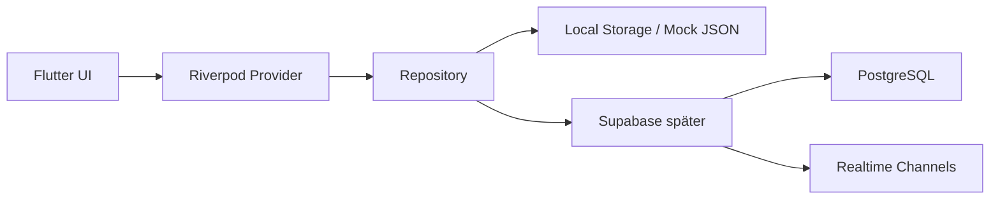
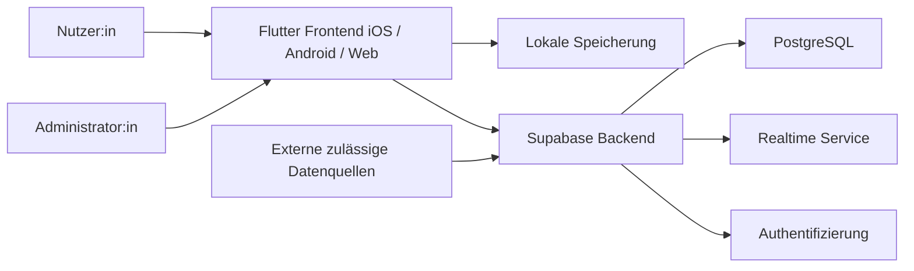

# 07 – Architecture

## Zielarchitektur

Spurfunk wird als Cross-Plattform-App mit Flutter umgesetzt. Der aktuelle Prototyp arbeitet lokal mit Mock-Daten und SharedPreferences. In späteren Phasen wird Supabase als Backend-as-a-Service angebunden.

## Technologie-Stack

| Komponente | Technologie |
|---|---|
| Frontend | Flutter / Dart |
| State Management | Riverpod |
| Routing | GoRouter |
| Lokale Speicherung | SharedPreferences, für sensible Daten Flutter Secure Storage |
| Responsive Design | LayoutBuilder, MediaQuery, Breakpoints |
| Prototyp-Datenbasis | Mock-Daten und lokale JSON-Strukturen |
| Ziel-Backend | Supabase |
| Ziel-Datenbank | PostgreSQL mit Row Level Security |
| Realtime | Supabase Realtime / WebSockets |
| Auth | Supabase Auth / JWT |

## Architekturprinzipien

### 1. Cross-Plattform zuerst

Eine Codebasis für iOS, Android und Web.

### 2. UI und Businesslogik trennen

Widgets enthalten keine komplexe Businesslogik. Logik liegt in Services, Repositories oder Riverpod-Notifiers.

### 3. Mock-first, Backend-ready

Alle Features sollen zunächst mit Mock-Daten laufen können. Die Datenzugriffsschicht muss später gegen Supabase austauschbar sein.

### 4. Realtime-ready

Live-Voting und Chat werden so modelliert, dass sie später per WebSocket/Realtime-Stream aktualisiert werden können.

### 5. Privacy by Design

Minimale Datenerhebung, keine Klarnamenpflicht, keine Echtfotos.

## Empfohlene Flutter-Projektstruktur

```text
lib/
  main.dart
  app.dart
  core/
    constants/
    theme/
    routing/
    widgets/
    utils/
  features/
    onboarding/
      data/
      domain/
      presentation/
    home/
      data/
      domain/
      presentation/
    live/
      data/
      domain/
      presentation/
    community/
      data/
      domain/
      presentation/
    facts/
      data/
      domain/
      presentation/
    profile/
      data/
      domain/
      presentation/
    settings/
      data/
      domain/
      presentation/
  shared/
    models/
    repositories/
    services/
    mock_data/
```

## Datenfluss



## Systemkontext



## Kritische technische Herausforderungen

### Peak Times

Sonntag 20:15 bis 21:45 Uhr kann hohe Last verursachen. Chat, Voting und Ergebnisupdates müssen effizient sein.

### Client-Ressourcen

WebSockets, Animationen und Chat dürfen CPU und Akku nicht unnötig belasten. Provider und Streams müssen sauber disposed werden.

### Realtime-Latenz

Ziel: Chat- und Voting-Updates unter 2 Sekunden.
