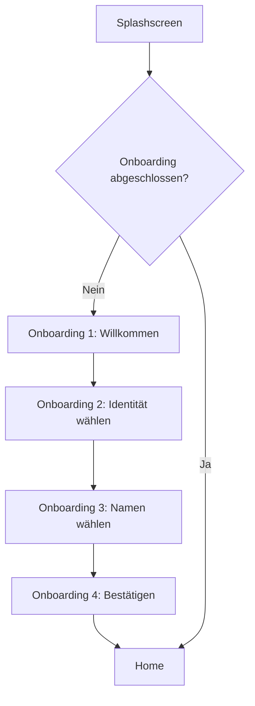
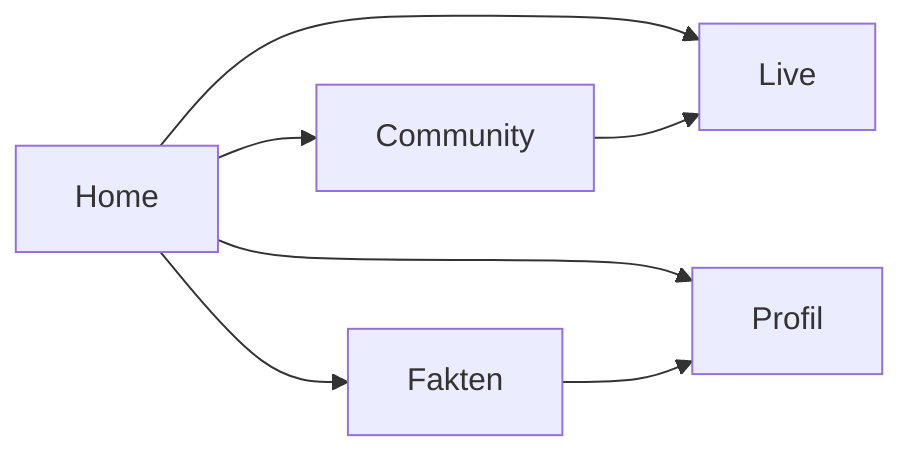
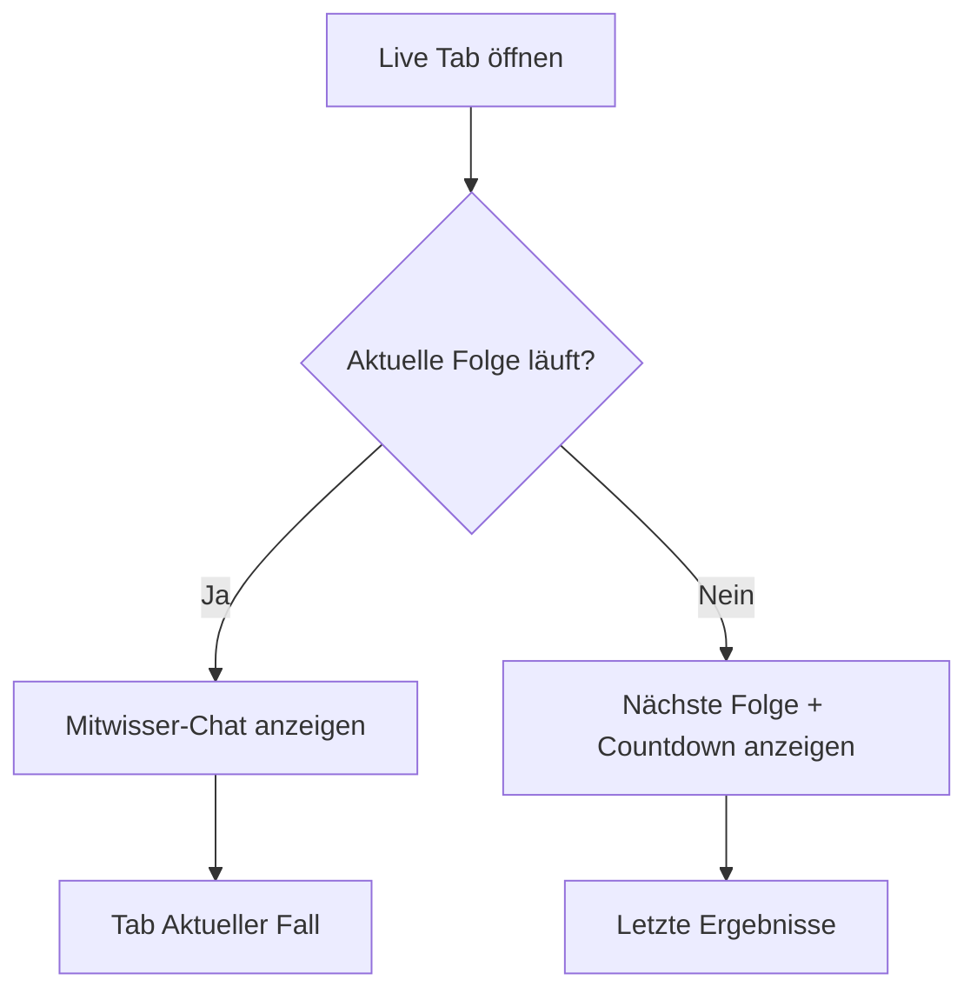

# 10 – Navigation

## Navigationsprinzip

Spurfunk nutzt eine klare Hauptnavigation über eine permanente Tab-Bar auf allen Hauptscreens.

## Hauptbereiche

1. Home
2. Community
3. Live
4. Fakten
5. Profil

Die Tab-Bar zeigt fünf Symbole ohne Textlabel. Der aktive Tab ist rot hervorgehoben und besitzt einen roten Indikator am unteren Bildschirmrand.

## App-Start Flow

## Hauptnavigation

## Screen-Routen mit GoRouter

| Route | Screen | Beschreibung |
|---|---|---|
| `/` | SplashScreen | Einstieg und Initialprüfung |
| `/onboarding/welcome` | OnboardingWelcomeScreen | Willkommen |
| `/onboarding/avatar` | AvatarSelectionScreen | Identität wählen |
| `/onboarding/alias` | AliasSelectionScreen | Namen wählen |
| `/onboarding/confirm` | OnboardingConfirmScreen | Bestätigung |
| `/home` | HomeScreen | Feed / Live-Hinweis |
| `/live` | LiveScreen | Chat oder Nicht-Live-Ansicht |
| `/live/case` | CurrentCaseScreen | Aktueller Fall |
| `/community` | CommunityScreen | Tabs: Statistik, Quiz, Memory, Rangliste |
| `/community/stats/:episodeId` | VoteStatsDetailScreen | Detailstatistik |
| `/community/quiz` | QuizScreen | Quiz |
| `/community/memory` | MemoryScreen | Memory |
| `/facts` | FactsScreen | Faktenbereich |
| `/facts/team/:teamId` | TeamDetailScreen | Ermittlerteam |
| `/profile` | ProfileScreen | Akte |
| `/profile/settings` | SettingsScreen | Einstellungen |
| `/profile/badges` | BadgesScreen | Badge-Sammlung |
| `/notifications` | NotificationsScreen | Benachrichtigungen |
| `/legal/privacy` | PrivacyScreen | Datenschutz |
| `/legal/imprint` | ImprintScreen | Impressum |
| `/help` | HelpFaqScreen | Hilfe / FAQ |

## Live-Zustandslogik

## Navigation-Regeln für Cursor

- Tab-Bar bleibt auf allen Hauptscreens sichtbar.
- Onboarding und Detailseiten dürfen Tab-Bar ausblenden, wenn Fokus nötig ist.
- Primäre Aktionen sind rot.
- Zurück-Navigation muss auf Detailseiten klar funktionieren.
- Keine tief verschachtelten Klickpfade für Live-Funktionen.
