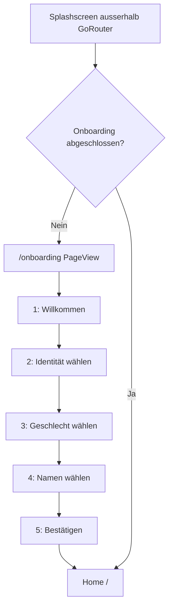
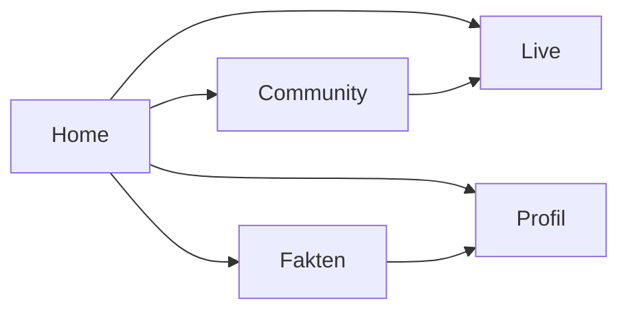
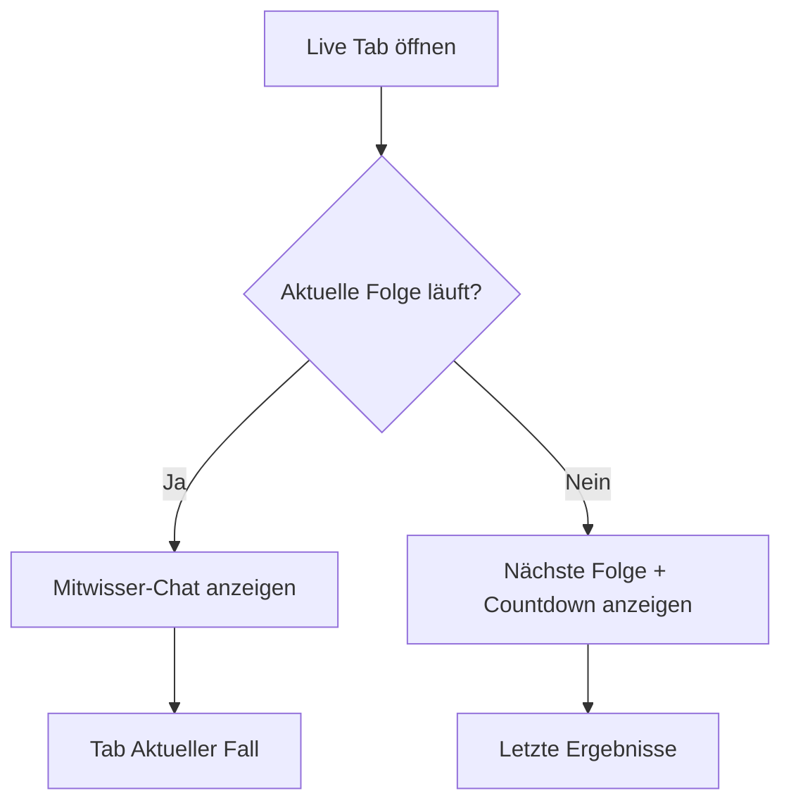

# 10 – Navigation

## Navigationsprinzip

Spurfunk nutzt eine klare Hauptnavigation über eine permanente Tab-Bar auf allen Hauptscreens.

## Hauptbereiche

1. Home
2. Community
3. Live
4. Fakten
5. Profil

Die Tab-Bar zeigt fünf Symbole ohne Textlabel. Der aktive Tab ist rot hervorgehoben und besitzt einen roten Indikator am unteren Bildschirmrand.

## App-Start Flow

## Hauptnavigation

## Screen-Routen mit GoRouter

| Route | Screen | Beschreibung |
|---|---|---|
| *(vor Router)* | SplashScreen | Einstieg via `MaterialApp(home:)` |
| `/onboarding` | OnboardingScreen | PageView mit 5 Schritten |
| `/` | HomeScreen | Feed / Live-Hinweis |
| `/live` | LiveEpisodeScreen | Chat oder Nicht-Live-Ansicht |
| `/live/team/:investigatorId` | InvestigatorDetailScreen | Ermittler-Detail |
| `/live/team-detail/:teamId` | TeamDetailScreen | Team-Detail |
| `/community` | CommunityScreen | Tabs: Statistik, Quiz, Memory, Rangliste |
| `/community/stats/:episodeId` | EpisodeStatsDetailScreen | Detailstatistik |
| `/community/quiz/play` | QuizPlayScreen | Quiz (Query: category, session) |
| `/community/memory/play` | MemoryPlayScreen | Memory (Query: id, session) |
| `/facts` | FactsScreen | Faktenbereich (Query: tab) |
| `/profile` | ProfileScreen | Akte |
| `/profile/stats` | ProfileStatsScreen | Persönliche Statistiken |
| `/profile/activity` | ProfileActivityScreen | Aktivitätstracker |
| `/profile/badges` | ProfileBadgesScreen | Badge-Sammlung |
| `/profile/settings` | SettingsScreen | Einstellungen |
| `/profile/settings/notifications` | NotificationsSettingsScreen | Benachrichtigungen |
| `/profile/settings/design` | DesignSettingsScreen | App-Design |
| `/profile/settings/accessibility` | AccessibilitySettingsScreen | Barrierefreiheit |
| `/profile/settings/help` | HelpSettingsScreen | Hilfe / FAQ |
| `/profile/settings/profile` | ProfileSettingsScreen | Profil-Einstellungen |
| `/profile/settings/about` | AboutAppScreen | Über Spurfunk |
| `/profile/settings/privacy` | PrivacyScreen | Datenschutz |

## Live-Zustandslogik

## Navigationsregeln

- Tab-Bar bleibt auf allen Hauptscreens sichtbar.
- Onboarding und Detailseiten dürfen Tab-Bar ausblenden, wenn Fokus nötig ist.
- Primäre Aktionen sind rot.
- Zurück-Navigation muss auf Detailseiten klar funktionieren.
- Keine tief verschachtelten Klickpfade für Live-Funktionen.
